# 💒 서비스 소개

**우리의 집**은 같은 아파트 거주민들만의 **특별한 공간**을 제공합니다!

서로의 일상을 공유함으로써, 삶이 윤택해지는 경험을 해보세요🌟

 

# 🔥 팀명: 어? 금지

| 이름 | 포지션 | 역할 |
| --- | --- | --- |
| 한종승 | 팀장 | DB 설계, DDL, 프로시저, README 작성 |
| 송보석 | 팀원 | DB 설계, DDL, 프로시저, PPT 제작|
| 장은지 | 팀원 | DB 설계, DML, DB 안정성 테스트, 자료조사 |
| 김지한 | 팀원 | DB 설계, DML, DB 안정성 테스트, 자료조사 |

 

# 🔎 WBS

    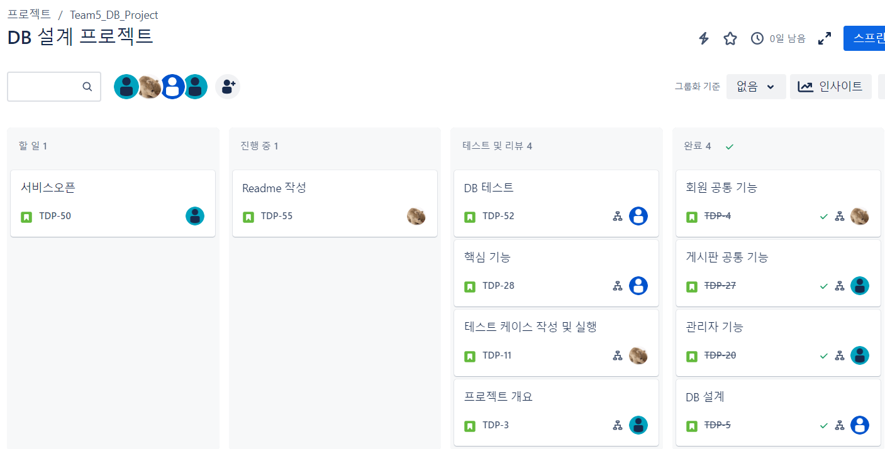

 

# 💡 프로젝트 배경

**📌 이런 경험 있지 않으신가요?**
1. 1인분만 시키고 싶은데 최소 주문 금액을 맞춰야 해서 사이드 메뉴를 추가했어요
2. 매 해 인상되는 배달료가 부담스러워요
3. 상태는 괜찮지만 안쓰는 가구를 이웃에게 나누고 싶어요
4. 층간 소음이 심한데 누구한테 신고를 해야할 지 모르겠어요
5. 아파트 공사, 이사 일정이 궁금해요

 

**📰 관련 기사 및 자료**
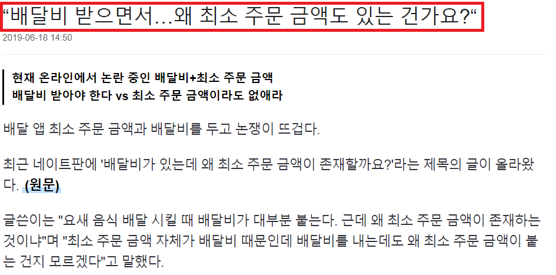
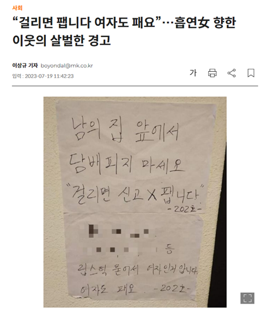
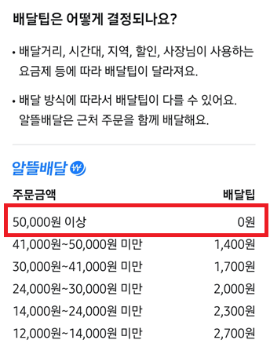
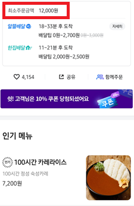

 

# 📌 핵심 기능
| 기능 | 설명 |
| --- | --- |
| 배달해요 | 1. 원하는 배달 업체 선정 후 공동 배달 게시글 작성   2. 공동 배달 참여   3. 공동 배달 참여자들 간 소통 가능한 채팅방 개설 |
| 공구해요 | 1. 구매 원하는 상품의 구매 링크를 게시글에 등록   2. 공동 구매 참여   3. 공동 구매 참여자들 간 소통 가능한 채팅방 개설 |
| 나눔해요 | 나눔 희망하는 물건을 게시글에 등록 |
| 조심해요 | 아파트 민원 사항을 게시글에 등록 |
| 자유게시판 | 자유롭게 소통할 수 있는 게시판 |

 

# 🌻 기본 기능
| 기능 | 설명 |
| --- | --- |
| 회원가입 | 1. 현재 거주 중인 아파트 선택   2. 실거주 여부 확인을 위한 주민등록증 첨부   3. 관리자 승인 후 정상 회원가입 |
| 좋아요 | 게시글, 댓글 좋아요 |
| 댓글 | 댓글, 대댓글 작성 |
| 마이페이지 | 1. 내가 쓴 게시글 카테고리 별 조회   2. 내가 쓴 댓글에 대한 게시글 조회   3. 내가 좋아요 한 게시글 조회   4. 내가 참여하고 있는 채팅방 조회 |
| 공지사항 | 관리자만 작성 가능|

 

# ✏️ 개념적 모델링

    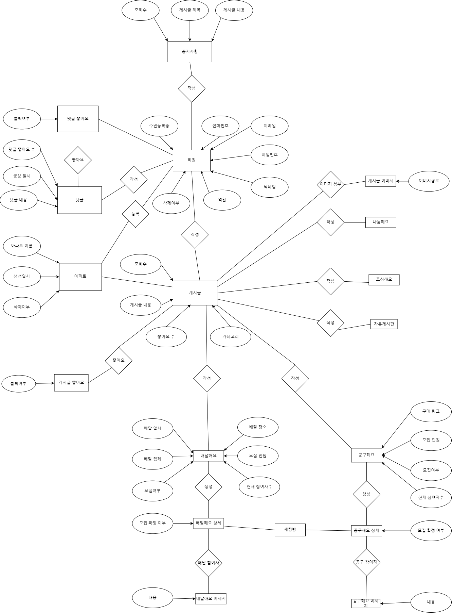

 

# 📅 논리적 모델링 (ERD)

    

# 핵심 쿼리

    
배달해요 게시글 작성 및 조회

    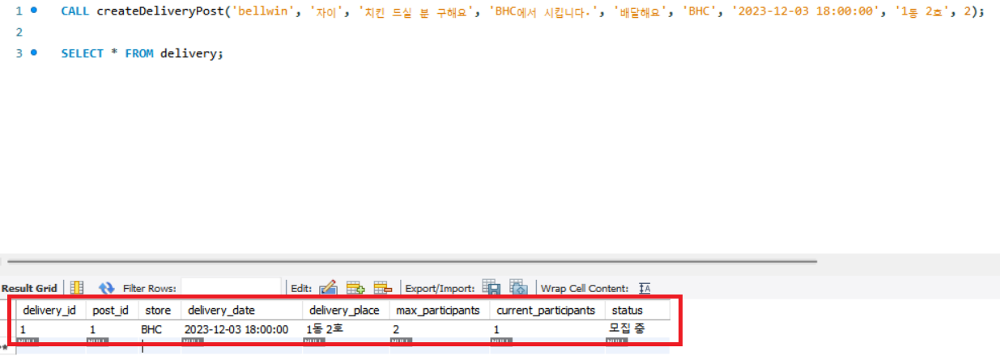

    
타 아파트 거주민이 게시글 작성 시도 시 에러

    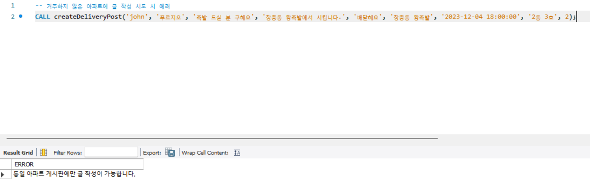

    
일반 게시판(자유게시판, 나눔해요, 조심해요) 작성 시 카테고리 자동 분류

    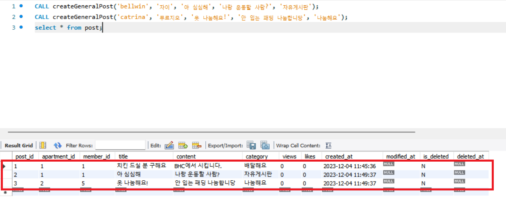

    
유저가 특정 배달해요 게시글에 참여하기 클릭 시 현재 참여 인원 수 1 증가

    

    
모집 인원이 가득 찬 배달해요 게시글에 참여하기 클릭 시 에러

    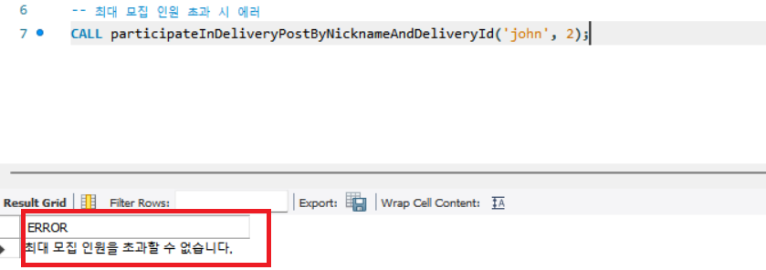

    
모집 인원 달성 시 채팅방 자동 개설

    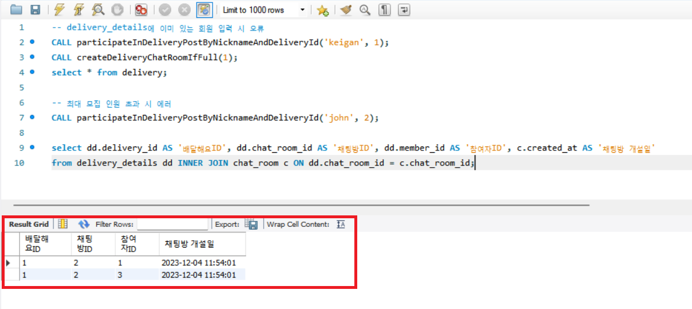

    
모든 아파트 거주민들이 작성한 게시글 조회

    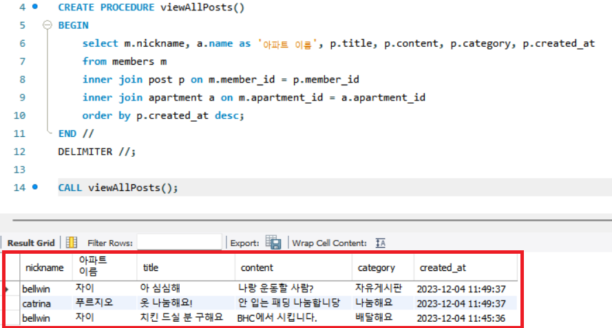

    
배달해요 특정 게시글의 참여 중인 유저들의 닉네임 조회

    

